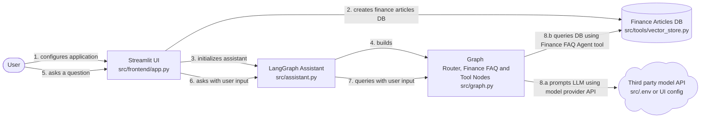
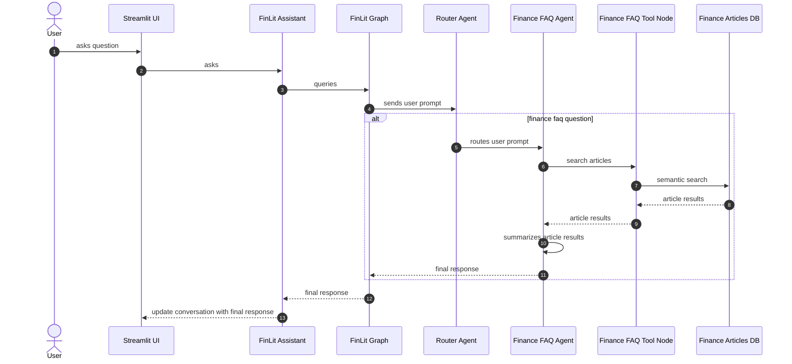

# Finlit AI Assistant


> A financial education multi-agent AI assistant that specialized in Financial Literarcy and Investment insights.

## Table of Contents
1. [Architecture](#architecture)
2. [Tech Stack](#tech-stack)
2. [Quick Start](#-quick-start)
3. [Project Structure](#project-structure)

## Architecture
### High Level System
The high level system diagram belowe depics how user queries and provided data flow through the FinLit AI assistant.


### Question Flowchart
The flow chart below shows what happens when a user asks a single question. 



## Tech Stack

| Layer              | Tool                                                     | Why it is here                                                              |
| ------------------ | -------------------------------------------------------- | --------------------------------------------------------------------------- |
|UI                  | [Streamlit](https://streamlit.io)                        | Zero-boilerplate web app. One file, top to bottom.                          |
|Agent framework     | [LangChain](https://www.langchain.com)                   | Generic way of creating AI agents and tools. Supports OpenAI, Anthropic, Google and more |
|Agent orchestration | [LangGraph](https://docs.langchain.com/oss/python/langgraph/overview)| Orchestration framework and runtime for managing, build and deploying stateful agents|
|Vector DB           | [ChromaDB](https://docs.trychroma.com/) | Open source vector database supporting semantic and metadata search

## 🚀 Quick Start

### 1. Create a virtual environment (recommended)

**Windows (PowerShell):**
```powershell
py -m venv .venv
```

**macOS/Linux:**
```bash
python3 -m venv .venv
```

### 2. Activate the virtual environment

**Windows (PowerShell):**
```powershell
Set-ExecutionPolicy -Scope Process -ExecutionPolicy Bypass; .\.venv\Scripts\Activate.ps1
```

**Windows (CMD):**
```bat
.venv\Scripts\activate.bat
```

**macOS/Linux:**
```bash
source .venv/bin/activate
```

### 3. Install dependencies
```bash
pip install --upgrade pip
pip install -e .
```


### 4. Configure Model and Embeddings Provider

**Windows (PowerShell):**
```powershell
Copy-Item .env.example .env
```

**macOS/Linux:**
```bash
cp .env.example .env
```

Then edit `.env` and set model and embeddings config. For an example:
```env
MODEL_PROVIDER=anthropic
MODEL_API_KEY=your_anthropic_api_key
MODEL=anthropic/claude-haiku-4-5-20251001
EMBEDDINGS_MODEL_PROVIDER=huggingface
EMBEDDINGS_MODEL_API_KEY=your_hugging_face_api_key
EMBEDDINGS_MODEL=google/embeddinggemma-300m
```
>&#128161; Model providers are based on [LangChain providers](https://reference.langchain.com/python/langchain/chat_models/base/init_chat_model#parameters). Currently only anthropic and openai are tested. 

>&#128161; Embeddings providers are based on [LangChain providers](https://reference.langchain.com/python/langchain/embeddings/base/init_embeddings#parameters). Currently only hugging face and openai implemented.

To test your config see [unit tests](#6-Run-Tests)


### 5. Build and Install locally
#### 5.1 Regular install
```bash
python3 -m build
pip install .
```

#### 5.2 Editable install
Changes to source code reflect instantly with no re-install
```bash
python3 -m build
pip install -e .
```

### 6. Run Tests
#### 6.1 Test your configuration
This is a recommended test to ensure your .env is properly configured
```bash
pytest tests/tools/test_config.py
```

#### 6.2 Run All tests
```bash
pytest
```

### 7 Run Streamlit application
```
streamlit run src/frontend/app.py
```

### 8. (Developers Optional) Before raising PR or checking in code
Developer can run script before checking in code to run all static analysis and tests with code coverage
```bash
./scripts/run_checks.sh
```

## Project Structure
```
FINLIT-AI/                        #entire application
  .github/workflows               #github repo actions or workflows
    python-app.yml                #python pull request action for building, testing and code coverage
  data/                           #contains financial literacy data used by AI assisstant
    aicpa_article.json            #AICPA financial literacy articles
    investopedia_articles.json    #Investopedia financial literacy articles
  scripts/                        #directory for useful project scripts
    run_checks.sh                 #script to run static analysis and tests with code coverage
  src/                            #python source code
    agents/                       #python code related to LangGraph node, context schema and state
      __init__.py                 #package init file
      context_schema.py           #LangGraph runtime context schema defining shared objects used by the nodes (ie. llm, tools, etc...)
      finance_faq.py              #finance FAQ agent and prompt
      graph.py                    #builds the FinLit LangGraph with all the agents
      router.py                   #the router agent and prompt
      state.py                    #the shared state that is passed between the LangGraph Nodes
    frontend/                     #streamlit application
      __init__.py                 #package init file
    testutils/                    #folder for unit testing utils and tools
      __init__.py                 #package init file
      common.py                   #common unit testing functions
    tools/                        #tools used for the agents to import sample data and config
      __init__.py                 #package init file
      articles.py                 #loads financial literacy articles used by AI assistant for agentic RAG
      config.py                   #gets the embeddings and chat model from the config .env file
      logger.py                   #common logger that can be used by any python file to log to stdout
      vector_store.py             #Chroma DB store functionality for local persistence
    __init__.py                   #package init file
    assistant.py                  #defines the FinLitAssistant
  tests/                          #python unit tests using pytest
    agents/                       #agent unit tests
      test_finance_faq.py         #tests for the finance FAQ agent
      test_graph.py               #tests for the FinLit Graph
      test_router.py              #tests for the router agent
    tools/                        #tools unit tests
      test_articles.py            #tests for the financial articles functions and tools
      test_config.py              #config unit tests
      test_vector_store.py        #vector store unit tests
    test_assistant.py             #test for the FinLit assistant
  .env.example                    #example config file
  .gitignore                      #git ignore file
  LICENSE                         #license information
  pyproject.toml                  #python project file
  README.md                       #this file 
```